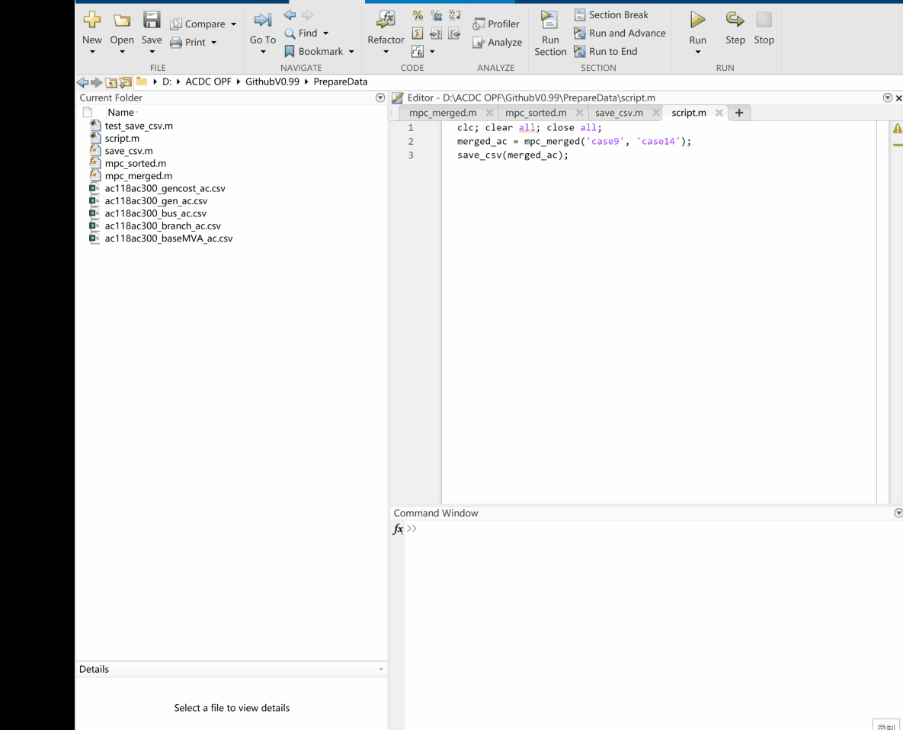

# 📝 Preparing AC/DC Grid Data

The data required for AC/DC OPF is listed and shown below, and all data are stored in .csv format
due to its compatibility with various coding language environments. Matpower provides various AC grid case files. 

Sometimes, we may want
to directly select and integrate multiple AC grids without manually modifying data files. To facilitate this
process, we provide auxiliary functions.

---

## 📁 Function Description

| Function Name | Description |
|---------------|-------------|
| `mpc_merged`  | Merges multiple MATPOWER AC grid case files into one unified structure.|
| `mpc_sorted`  | Reorders bus numbers and updates generator and branch references accordingly. |
| `save_csv`    | Saves the merged AC system structure (`mpc_merged`) into separate `.csv` files for bus, gen, branch, gencost, and baseMVA data. |

---

## ▶️ Demo 

